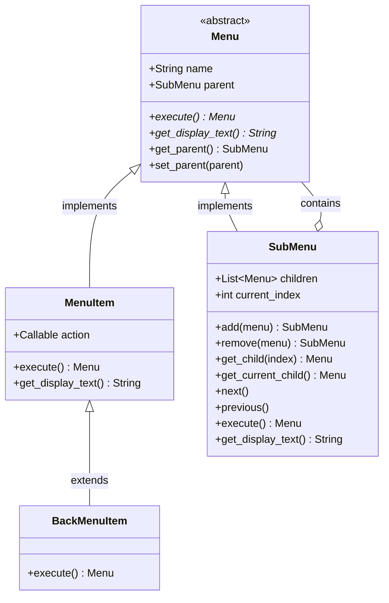
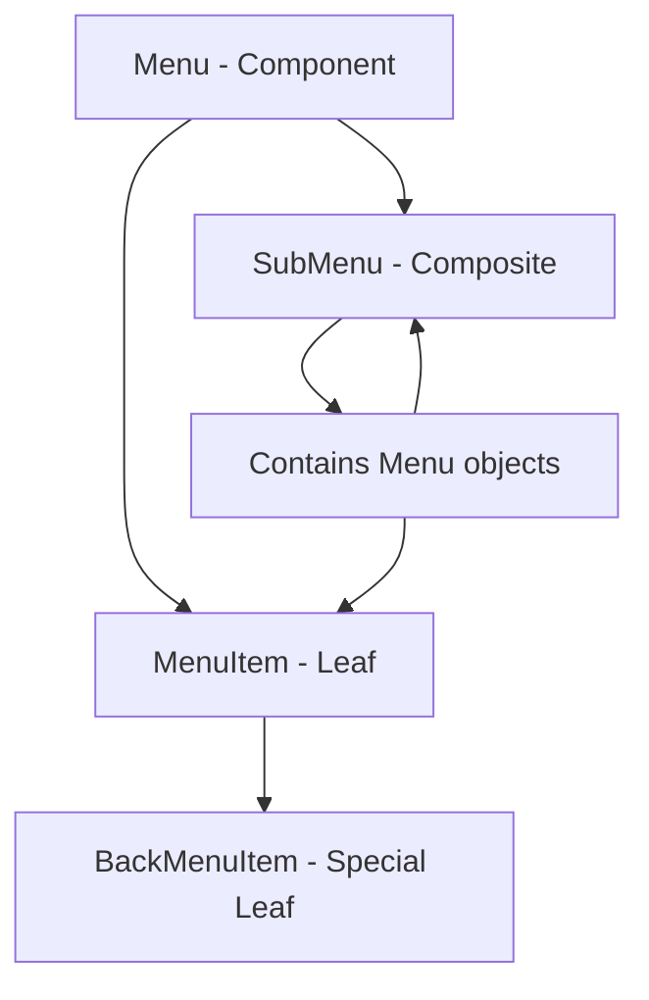
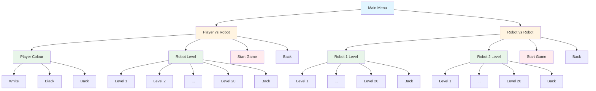
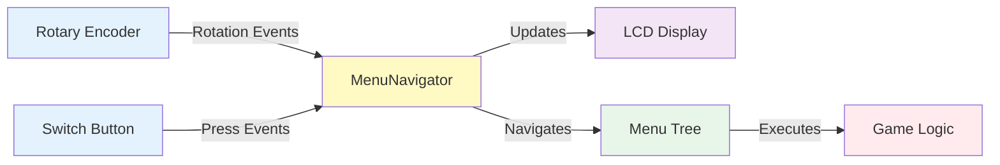
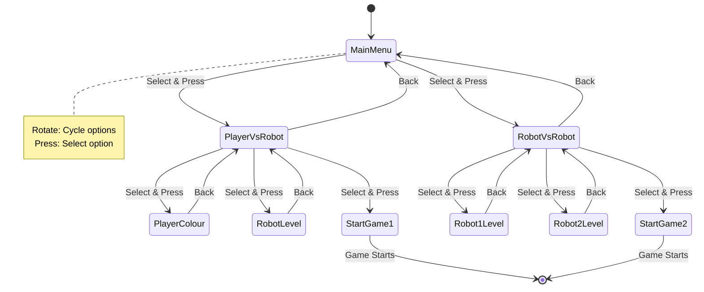
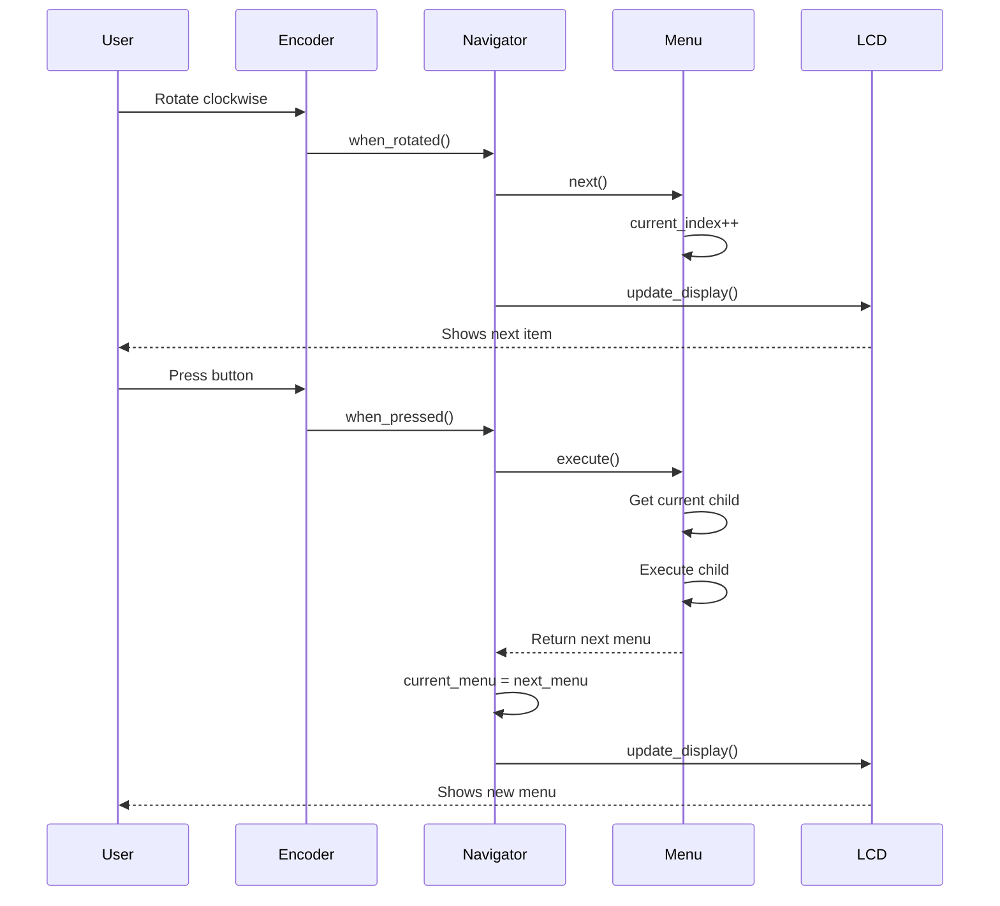

# Menu System Architecture

## Composite Pattern Structure



## Component Relationships



## Chess Menu Hierarchy



## System Integration



## Navigation Flow



## LCD Display Format

```
┌────────────────┐
│ Main Menu      │  ← Line 1: Current menu title
│ > Option 1 1/3 │  ← Line 2: > Current selection + position
└────────────────┘
     16 chars
```

### Display Components:
- **Line 1**: Current menu/submenu name (max 16 chars)
- **Line 2**: 
  - `>` : Selection indicator (1 char)
  - ` ` : Space (1 char)
  - Item name (variable, truncated if needed)
  - ` ` : Space (1 char)
  - `X/Y` : Position indicator (variable length)

## Event Flow



## Code Organization

```
display_and_input/
│
├── Core Pattern Implementation
│   └── menu.py
│       ├── Menu (Component)
│       ├── MenuItem (Leaf)
│       ├── SubMenu (Composite)
│       └── BackMenuItem (Special Leaf)
│
├── Hardware Integration
│   ├── LCD.py (Display driver)
│   └── menu_navigator.py (Integration layer)
│
├── Application Layer
│   └── chess_menu.py (Chess-specific menu builder)
│
└── Testing & Documentation
    ├── menu_example.py (Test file)
    ├── README.md (User documentation)
    └── ARCHITECTURE.md (This file)
```

## Key Design Decisions

### 1. Composite Pattern
- **Why**: Natural fit for hierarchical menu structure
- **Benefit**: Uniform treatment of items and submenus
- **Trade-off**: Slightly more complex than simple list-based menu

### 2. Insertion Order Preservation
- **Implementation**: Python list maintains insertion order
- **Benefit**: Predictable menu item ordering
- **Alternative**: Could use explicit ordering numbers

### 3. Parent References
- **Why**: Enable "Back" navigation
- **Benefit**: Easy to navigate up the tree
- **Trade-off**: Bidirectional references require careful management

### 4. Callback-based Actions
- **Why**: Flexible action execution
- **Benefit**: Decouple menu structure from game logic
- **Alternative**: Could use command pattern for undo/redo

### 5. Two-line LCD Display
- **Line 1**: Context (current menu)
- **Line 2**: Selection (current item + position)
- **Benefit**: User always knows where they are
- **Limitation**: Long item names must be truncated

## Extension Points

### Adding New Menu Item Types

```python
class ToggleMenuItem(MenuItem):
    """Example: Menu item with on/off state"""
    def __init__(self, name, toggle_action):
        super().__init__(name, toggle_action)
        self.state = False
    
    def execute(self):
        self.state = not self.state
        if self.action:
            self.action(self.state)
        return None
    
    def get_display_text(self):
        return f"{self.name} [{'ON' if self.state else 'OFF'}]"
```

### Custom Display Formatting

```python
class IconMenuItem(MenuItem):
    """Example: Menu item with custom icon"""
    def __init__(self, name, action, icon="•"):
        super().__init__(name, action)
        self.icon = icon
    
    def get_display_text(self):
        return f"{self.icon} {self.name}"
```

### Validation/Conditional Items

```python
class ConditionalMenuItem(MenuItem):
    """Example: Menu item that can be disabled"""
    def __init__(self, name, action, enabled_func):
        super().__init__(name, action)
        self.enabled_func = enabled_func
    
    def execute(self):
        if self.enabled_func():
            return super().execute()
        return None
    
    def get_display_text(self):
        if self.enabled_func():
            return self.name
        return f"{self.name} (disabled)"
```
